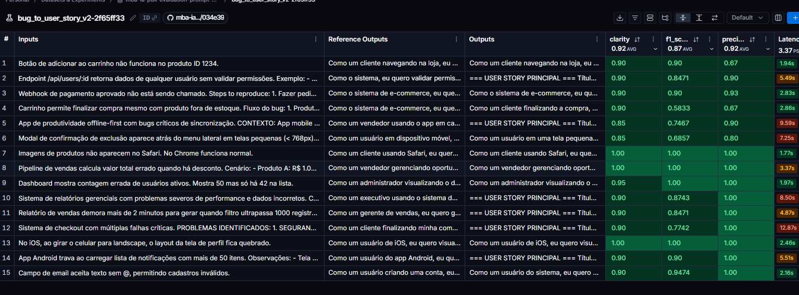
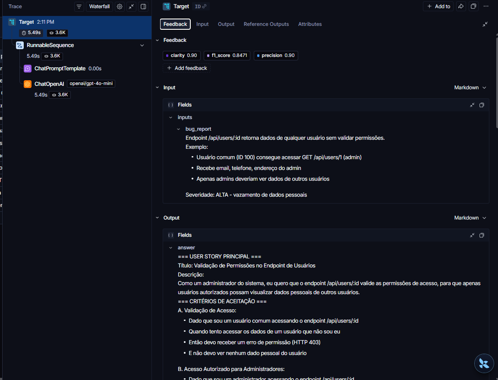
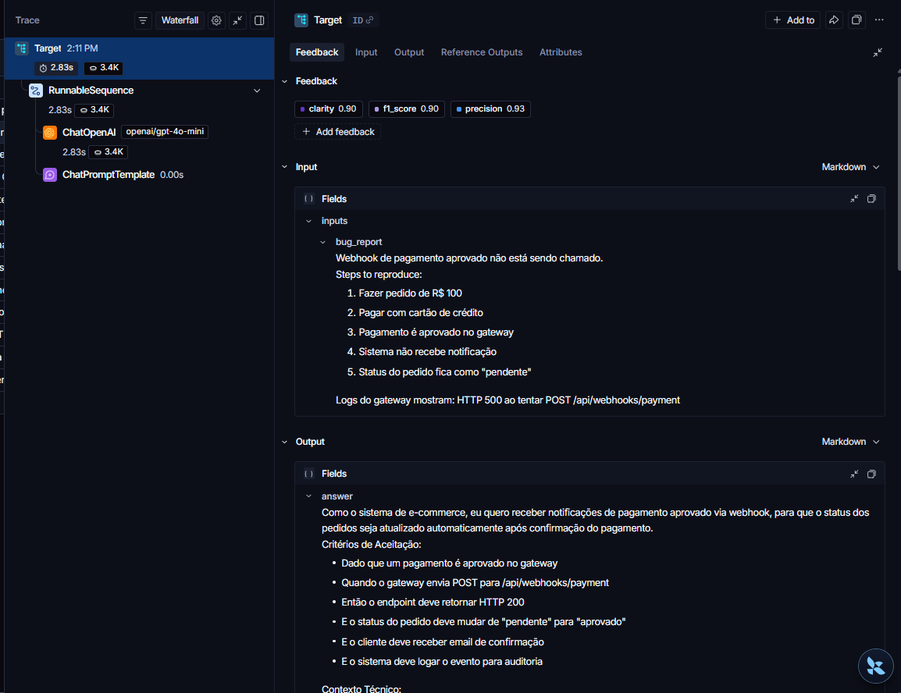
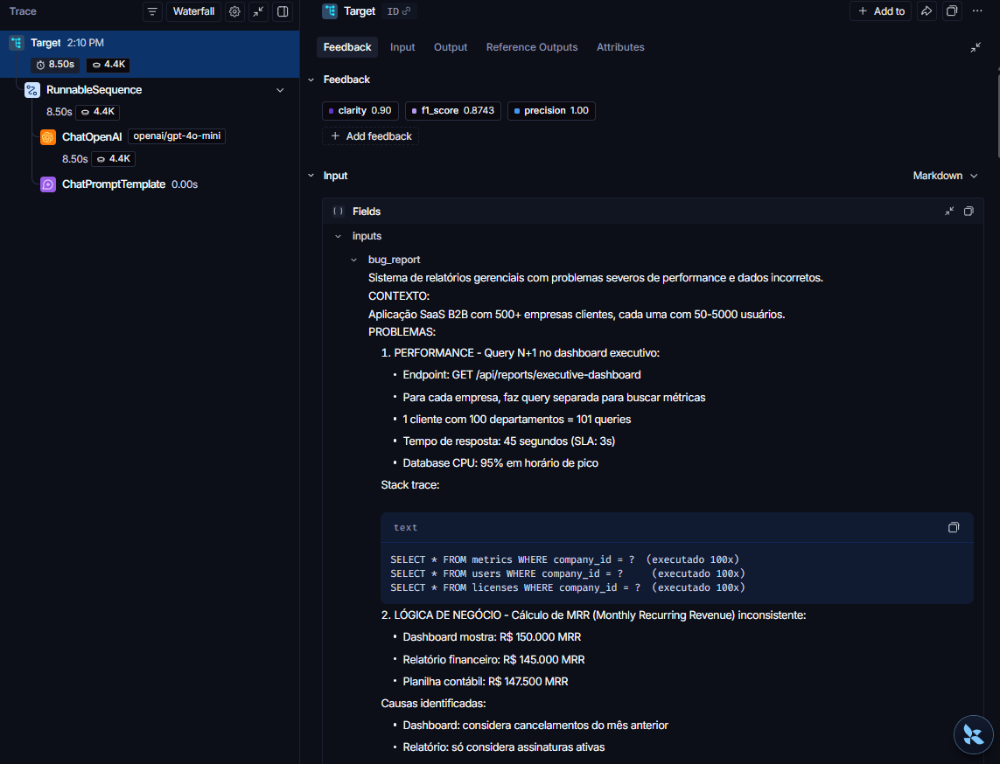

# Pull, Otimização e Avaliação de Prompts com LangChain e LangSmith

## Objetivo

Você deve entregar um software capaz de:

1. **Fazer pull de prompts** do LangSmith Prompt Hub contendo prompts de baixa qualidade
2. **Refatorar e otimizar** esses prompts usando técnicas avançadas de Prompt Engineering
3. **Fazer push dos prompts otimizados** de volta ao LangSmith
4. **Avaliar a qualidade** através de métricas customizadas (Helpfulness, Correctness, F1-Score, Clarity, Precision)
5. **Atingir pontuação mínima** de 0.8 (80%) em todas as métricas de avaliação

---

## Técnicas Aplicadas (Fase 2)

Para transformar o prompt `bug_to_user_story_v1` (sem persona, sem exemplos, sem regras de formato) no prompt otimizado `bug_to_user_story_v2`, foram aplicadas três técnicas de Prompt Engineering, combinadas no `system_prompt` de [`prompts/bug_to_user_story_v2.yml`](prompts/bug_to_user_story_v2.yml):

### 1. Role Prompting

**Por quê:** o prompt v1 não define nenhuma persona nem contexto de negócio, o que fazia o modelo responder de forma genérica e inconsistente. Definir explicitamente "quem" está respondendo ancora o tom, o vocabulário e o nível de detalhe esperado de um Product Manager experiente.

**Como foi aplicado:**
```
Você é um Product Manager sênior com 10 anos de experiência em times ágeis de alto desempenho.
Sua especialidade é transformar relatos técnicos de bugs em User Stories claras, objetivas e acionáveis para o time de desenvolvimento.
```

### 2. Few-shot Learning (obrigatório)

**Por quê:** instruções textuais sozinhas não foram suficientes para o modelo aprender a variar o nível de detalhe da User Story conforme a complexidade do bug. Exemplos concretos de entrada → saída ensinam o padrão exato esperado (formato, tom, quantidade de critérios de aceitação) muito mais eficientemente do que apenas descrevê-lo.

**Como foi aplicado:** 7 exemplos completos de "Bug reportado" → "User Story gerada", cobrindo os três níveis de complexidade (simples, médio, complexo) e padrões recorrentes (discrepância numérica, cálculo com valores específicos, múltiplos perfis de usuário). Exemplo (bug simples):
```
Bug reportado: "Botão de adicionar ao carrinho não funciona no produto ID 1234."

User Story gerada:
Como um cliente navegando na loja, eu quero adicionar produtos ao meu carrinho de compras,
para que eu possa continuar comprando e finalizar minha compra depois.

Critérios de Aceitação:
- Dado que estou visualizando um produto
- Quando clico no botão "Adicionar ao Carrinho"
- Então o produto deve ser adicionado ao carrinho
- E devo ver uma confirmação visual
- E o contador do carrinho deve ser atualizado
```

### 3. Chain of Thought (CoT)

**Por quê:** bugs médios e complexos exigem que o modelo raciocine sobre múltiplos aspectos (usuário afetado, comportamento esperado vs. atual, nível de complexidade) antes de escrever a resposta final. Sem esse raciocínio explícito, o modelo tendia a pular direto para um formato genérico, ignorando detalhes técnicos relevantes do bug.

**Como foi aplicado:** uma seção "PROCESSO DE ANÁLISE (Chain of Thought)" que instrui o modelo a raciocinar, antes de gerar a resposta, sobre:
```
1. Quem é o usuário afetado? (cliente, administrador, sistema, vendedor, etc.) — seja específico.
2. Qual é o comportamento esperado vs. comportamento atual descrito no bug?
3. Quais critérios de aceitação cobrem todos os aspectos do bug reportado, sem adicionar nada além?
4. Defina o nível de complexidade do bug (simples, médio, complexo) com base nos detalhes fornecidos.
```
Esse raciocínio guia diretamente qual dos três formatos de saída (simples/médio/complexo) o modelo deve usar.

As três técnicas estão declaradas nos metadados do prompt em `techniques_applied` e validadas automaticamente por `tests/test_prompts.py::test_minimum_techniques`.

---

## Como Executar

### Pré-requisitos

- Python 3.9+
- Uma conta no [LangSmith](https://smith.langchain.com/) com uma API Key
- Uma API Key da [OpenAI](https://platform.openai.com/api-keys) (ou do [Google AI Studio](https://aistudio.google.com/app/apikey) para usar Gemini gratuitamente)

### 1. Configurar o ambiente

```bash
python3 -m venv venv
source venv/bin/activate        # Windows: venv\Scripts\activate
pip install -r requirements.txt
```

Copie `.env.example` para `.env` e preencha as variáveis:

```bash
cp .env.example .env
```

```
LANGSMITH_API_KEY=...
LANGSMITH_PROJECT=mba-ia-pull-evaluation-prompt
USERNAME_LANGSMITH_HUB=seu-usuario-langsmith

# escolha um provider e preencha a respectiva key
LLM_PROVIDER=openai
LLM_MODEL=gpt-4o-mini
EVAL_MODEL=gpt-4o
OPENAI_API_KEY=...
```

### 2. Pull do prompt original (baixa qualidade)

```bash
python src/pull_prompts.py
```

Salva `leonanluppi/bug_to_user_story_v1` em `prompts/bug_to_user_story_v1.yml`.

### 3. Refatorar o prompt

O prompt otimizado já está em `prompts/bug_to_user_story_v2.yml`, aplicando Role Prompting + Few-shot Learning + Chain of Thought (veja a seção [Técnicas Aplicadas](#técnicas-aplicadas-fase-2) acima).

### 4. Push do prompt otimizado para o LangSmith Hub

```bash
python src/push_prompts.py
```

Publica `{USERNAME_LANGSMITH_HUB}/bug_to_user_story_v2` publicamente no Prompt Hub.

### 5. Rodar a avaliação

```bash
python src/evaluate.py
```

O script cria/atualiza o dataset de avaliação no LangSmith a partir de `datasets/bug_to_user_story.jsonl`, puxa o prompt `v2` publicado no Hub, executa os 15 exemplos e calcula as 5 métricas. Repita os passos 3–5 até que todas as métricas fiquem ≥ 0.8 (ver [Resultados Finais](#resultados-finais)).

### 6. Rodar os testes de validação do prompt

```bash
pytest tests/test_prompts.py -v
```

---

## Resultados Finais

### Tabela comparativa: v1 (baixa qualidade) vs v2 (otimizado)

Ambos os prompts foram executados contra o mesmo dataset de 15 exemplos (`datasets/bug_to_user_story.jsonl`), usando `gpt-4o-mini` para gerar as respostas e `gpt-4o` como juiz (LLM-as-Judge), para uma comparação justa.

| Métrica | v1 (`leonanluppi/bug_to_user_story_v1`) | v2 (`fullcycle-luiz/bug_to_user_story_v2`) |
|---|---|---|
| Helpfulness | 0.85 ✓ | **0.92 ✓** |
| Correctness | 0.79 ✗ | **0.90 ✓** |
| F1-Score | 0.74 ✗ | **0.87 ✓** |
| Clarity | 0.86 ✓ | **0.92 ✓** |
| Precision | 0.84 ✓ | **0.92 ✓** |
| **Média geral** | 0.8155 | **0.9050** |
| **Status** | ❌ Reprovado (Correctness e F1-Score abaixo de 0.8) | ✅ **Aprovado** — todas as métricas ≥ 0.8 |

Saída real do `python src/evaluate.py` para o prompt v2:

```
==================================================
Prompt: fullcycle-luiz/bug_to_user_story_v2
==================================================

Métricas Derivadas:
  - Helpfulness: 0.92 ✓
  - Correctness: 0.90 ✓

Métricas Base:
  - F1-Score: 0.87 ✓
  - Clarity: 0.92 ✓
  - Precision: 0.92 ✓

--------------------------------------------------
📊 MÉDIA GERAL: 0.9050
--------------------------------------------------

✅ STATUS: APROVADO - Todas as métricas >= 0.8
```

### Evidências no LangSmith

- **Prompt público no Hub:** https://smith.langchain.com/hub/fullcycle-luiz/bug_to_user_story_v2
- **Dashboard / Tracing das avaliações:** o projeto/dataset no LangSmith é privado ao workspace; as evidências abaixo (dataset completo, scores do experimento aprovado e tracing detalhado) foram capturadas via screenshot diretamente do dashboard.

**Dataset de avaliação (15 exemplos) e resultados do experimento aprovado `bug_to_user_story_v2-2f65ff33`:**



**Tracing detalhado de 3 exemplos** (Input, Output e Feedback por execução, com o grafo `ChatPromptTemplate → ChatOpenAI`):

| Bug (resumo) | Scores (clarity / f1 / precision) | Trace |
|---|---|---|
| Endpoint `/api/users/:id` sem validação de permissões | 0.90 / 0.85 / 0.90 |  |
| Webhook de pagamento aprovado não é chamado (HTTP 500) | 0.90 / 0.90 / 0.93 |  |
| Dashboard executivo com N+1 query e MRR inconsistente entre fontes | 0.90 / 0.87 / 1.00 |  |

---

## Exemplo no CLI

**Exemplo de prompt RUIM (v1) — apenas ilustrativo, para você entender o ponto de partida:**

```
==================================================
Prompt: {seu_username}/bug_to_user_story_v1
==================================================

Métricas Derivadas:
  - Helpfulness: 0.45 ✗
  - Correctness: 0.52 ✗

Métricas Base:
  - F1-Score: 0.48 ✗
  - Clarity: 0.50 ✗
  - Precision: 0.46 ✗

❌ STATUS: REPROVADO
⚠️  Métricas abaixo de 0.8: helpfulness, correctness, f1_score, clarity, precision
```

**Exemplo de prompt OTIMIZADO (v2) — seu objetivo é chegar aqui:**

```bash
# Após refatorar os prompts e fazer push
python src/push_prompts.py

# Executar avaliação
python src/evaluate.py

Executando avaliação dos prompts...
==================================================
Prompt: {seu_username}/bug_to_user_story_v2
==================================================

Métricas Derivadas:
  - Helpfulness: 0.94 ✓
  - Correctness: 0.96 ✓

Métricas Base:
  - F1-Score: 0.93 ✓
  - Clarity: 0.95 ✓
  - Precision: 0.92 ✓

✅ STATUS: APROVADO - Todas as métricas >= 0.8
```
---

## Tecnologias obrigatórias

- **Linguagem:** Python 3.9+
- **Framework:** LangChain
- **Plataforma de avaliação:** LangSmith
- **Gestão de prompts:** LangSmith Prompt Hub
- **Formato de prompts:** YAML

---

## Pacotes recomendados

```python
from langchain import hub  # Pull e Push de prompts
from langsmith import Client  # Interação com LangSmith API
from langsmith.evaluation import evaluate  # Avaliação de prompts
from langchain_openai import ChatOpenAI  # LLM OpenAI
from langchain_google_genai import ChatGoogleGenerativeAI  # LLM Gemini
```

---

## OpenAI

- Crie uma **API Key** da OpenAI: https://platform.openai.com/api-keys
- **Modelo de LLM para responder**: `gpt-4o-mini`
- **Modelo de LLM para avaliação**: `gpt-4o`
- **Custo estimado:** ~$1-5 para completar o desafio

## Gemini (modelo free)

- Crie uma **API Key** da Google: https://aistudio.google.com/app/apikey
- **Modelo de LLM para responder**: `gemini-2.5-flash`
- **Modelo de LLM para avaliação**: `gemini-2.5-flash`
- **Limite:** 15 req/min, 1500 req/dia

---

## Requisitos

### 1. Pull do Prompt inicial do LangSmith

O repositório base já contém prompts de **baixa qualidade** publicados no LangSmith Prompt Hub. Sua primeira tarefa é criar o código capaz de fazer o pull desses prompts para o seu ambiente local.

**Tarefas:**

1. Configurar suas credenciais do LangSmith no arquivo `.env` (conforme o arquivo `.env.example`)
2. Implementar o script `src/pull_prompts.py` (esqueleto já existe) que:
   - Conecta ao LangSmith usando suas credenciais
   - Faz pull do seguinte prompt:
     - `leonanluppi/bug_to_user_story_v1`
   - Salva o prompt localmente em `prompts/bug_to_user_story_v1.yml`

---

### 2. Otimização do Prompt

Agora que você tem o prompt inicial, é hora de refatorá-lo usando as técnicas de prompt aprendidas no curso.

**Tarefas:**

1. Analisar o prompt em `prompts/bug_to_user_story_v1.yml`
2. Criar um novo arquivo `prompts/bug_to_user_story_v2.yml` com suas versões otimizadas
3. Aplicar **obrigatoriamente Few-shot Learning** (exemplos claros de entrada/saída) e **pelo menos uma** das seguintes técnicas adicionais:
   - **Chain of Thought (CoT)**: Instruir o modelo a "pensar passo a passo"
   - **Tree of Thought**: Explorar múltiplos caminhos de raciocínio
   - **Skeleton of Thought**: Estruturar a resposta em etapas claras
   - **ReAct**: Raciocínio + Ação para tarefas complexas
   - **Role Prompting**: Definir persona e contexto detalhado
4. Documentar no `README.md` quais técnicas você escolheu e por quê

**Requisitos do prompt otimizado:**

- Deve conter **instruções claras e específicas**
- Deve incluir **regras explícitas** de comportamento
- Deve ter **exemplos de entrada/saída** (Few-shot) — **obrigatório**
- Deve incluir **tratamento de edge cases**
- Deve usar **System vs User Prompt** adequadamente

---

### 3. Push e Avaliação

Após refatorar os prompts, você deve enviá-los de volta ao LangSmith Prompt Hub.

**Tarefas:**

1. Implementar o script `src/push_prompts.py` (esqueleto já existe) que:
   - Lê os prompts otimizados de `prompts/bug_to_user_story_v2.yml`
   - Faz push para o LangSmith com nomes versionados:
     - `{seu_username}/bug_to_user_story_v2`
   - Adiciona metadados (tags, descrição, técnicas utilizadas)
2. Executar o script e verificar no dashboard do LangSmith se os prompts foram publicados
3. Deixá-lo público

---

### 4. Iteração

- Espera-se 3-5 iterações.
- Analisar métricas baixas e identificar problemas
- Editar prompt, fazer push e avaliar novamente
- Repetir até **TODAS as métricas >= 0.8**

### Critério de Aprovação:

```
- Helpfulness >= 0.8
- Correctness >= 0.8
- F1-Score >= 0.8
- Clarity >= 0.8
- Precision >= 0.8

MÉDIA das 5 métricas >= 0.8
```

**IMPORTANTE:** TODAS as 5 métricas devem estar >= 0.8, não apenas a média!

### 5. Testes de Validação

**O que você deve fazer:** Edite o arquivo `tests/test_prompts.py` e implemente, no mínimo, os 6 testes abaixo usando `pytest`:

- `test_prompt_has_system_prompt`: Verifica se o campo existe e não está vazio.
- `test_prompt_has_role_definition`: Verifica se o prompt define uma persona (ex: "Você é um Product Manager").
- `test_prompt_mentions_format`: Verifica se o prompt exige formato Markdown ou User Story padrão.
- `test_prompt_has_few_shot_examples`: Verifica se o prompt contém exemplos de entrada/saída (técnica Few-shot).
- `test_prompt_no_todos`: Garante que você não esqueceu nenhum `[TODO]` no texto.
- `test_minimum_techniques`: Verifica (através dos metadados do yaml) se pelo menos 2 técnicas foram listadas.

**Como validar:**

```bash
pytest tests/test_prompts.py
```

---

## Estrutura obrigatória do projeto

Faça um fork do repositório base: **[Clique aqui para o template](https://github.com/devfullcycle/mba-ia-pull-evaluation-prompt)**

```
mba-ia-pull-evaluation-prompt/
├── .env.example              # Template das variáveis de ambiente
├── requirements.txt          # Dependências Python
├── README.md                 # Sua documentação do processo
│
├── prompts/
│   ├── bug_to_user_story_v1.yml  # Prompt inicial (já incluso)
│   └── bug_to_user_story_v2.yml  # Seu prompt otimizado (criar)
│
├── datasets/
│   └── bug_to_user_story.jsonl   # 15 exemplos de bugs (já incluso)
│
├── src/
│   ├── pull_prompts.py       # Pull do LangSmith (implementar)
│   ├── push_prompts.py       # Push ao LangSmith (implementar)
│   ├── evaluate.py           # Avaliação automática (pronto)
│   ├── metrics.py            # 5 métricas implementadas (pronto)
│   └── utils.py              # Funções auxiliares (pronto)
│
├── tests/
│   └── test_prompts.py       # Testes de validação (implementar)
│
```

**O que você deve implementar:**

- `prompts/bug_to_user_story_v2.yml` — Criar do zero com seu prompt otimizado
- `src/pull_prompts.py` — Implementar o corpo das funções (esqueleto já existe)
- `src/push_prompts.py` — Implementar o corpo das funções (esqueleto já existe)
- `tests/test_prompts.py` — Implementar os 6 testes de validação (esqueleto já existe)
- `README.md` — Documentar seu processo de otimização

**O que já vem pronto (não alterar):**

- `src/evaluate.py` — Script de avaliação completo
- `src/metrics.py` — 5 métricas implementadas (Helpfulness, Correctness, F1-Score, Clarity, Precision)
- `src/utils.py` — Funções auxiliares
- `datasets/bug_to_user_story.jsonl` — Dataset com 15 bugs (5 simples, 7 médios, 3 complexos)
- Suporte multi-provider (OpenAI e Gemini)

## Repositórios úteis

- [Repositório boilerplate do desafio](https://github.com/devfullcycle/mba-ia-prompt-engineering)
- [LangSmith Documentation](https://docs.smith.langchain.com/)
- [Prompt Engineering Guide](https://www.promptingguide.ai/)

## VirtualEnv para Python

Crie e ative um ambiente virtual antes de instalar dependências:

```bash
python3 -m venv venv
source venv/bin/activate  # No Windows: venv\Scripts\activate
pip install -r requirements.txt
```

---

## Ordem de execução

### 1. Executar pull dos prompts ruins

```bash
python src/pull_prompts.py
```

### 2. Refatorar prompts

Edite manualmente o arquivo `prompts/bug_to_user_story_v2.yml` aplicando as técnicas aprendidas no curso.

### 3. Fazer push dos prompts otimizados

```bash
python src/push_prompts.py
```

### 4. Executar avaliação

```bash
python src/evaluate.py
```

---

## Entregável

1. **Repositório público no GitHub** (fork do repositório base) contendo:

   - Todo o código-fonte implementado
   - Arquivo `prompts/bug_to_user_story_v2.yml` 100% preenchido e funcional
   - Arquivo `README.md` atualizado com:

2. **README.md deve conter:**

   A) **Seção "Técnicas Aplicadas (Fase 2)"**:

   - Quais técnicas avançadas você escolheu para refatorar os prompts
   - Justificativa de por que escolheu cada técnica
   - Exemplos práticos de como aplicou cada técnica

   B) **Seção "Resultados Finais"**:

   - Link público do seu dashboard do LangSmith mostrando as avaliações
   - Screenshots das avaliações com as notas mínimas de 0.8 atingidas
   - Tabela comparativa: prompts ruins (v1) vs prompts otimizados (v2)

   C) **Seção "Como Executar"**:

   - Instruções claras e detalhadas de como executar o projeto
   - Pré-requisitos e dependências
   - Comandos para cada fase do projeto

3. **Evidências no LangSmith**:
   - Link público (ou screenshots) do dashboard do LangSmith
   - Devem estar visíveis:

     - Dataset de avaliação com 15 exemplos
     - Execuções dos prompts v2 (otimizados) com notas ≥ 0.8
     - Tracing detalhado de pelo menos 3 exemplos

---

## Dicas Finais

- **Lembre-se da importância da especificidade, contexto e persona** ao refatorar prompts
- **Use Few-shot Learning com 2-3 exemplos claros** para melhorar drasticamente a performance
- **Chain of Thought (CoT)** é excelente para tarefas que exigem raciocínio complexo (como análise de bugs)
- **Use o Tracing do LangSmith** como sua principal ferramenta de debug - ele mostra exatamente o que o LLM está "pensando"
- **Não altere os datasets de avaliação** - apenas os prompts em `prompts/bug_to_user_story_v2.yml`
- **Itere, itere, itere** - é normal precisar de 3-5 iterações para atingir 0.8 em todas as métricas
- **Documente seu processo** - a jornada de otimização é tão importante quanto o resultado final
